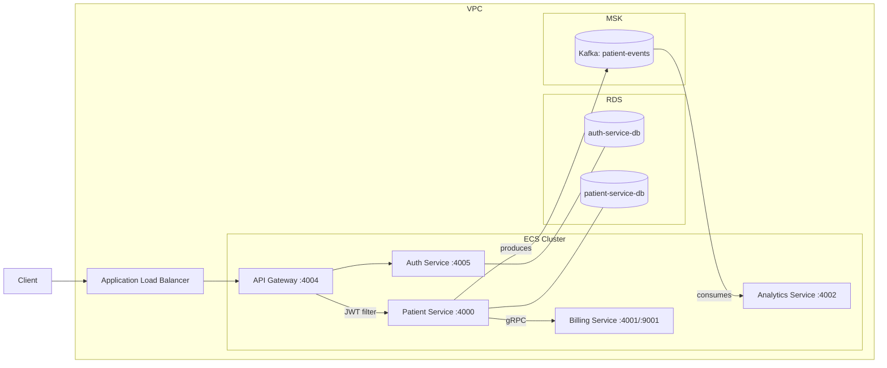

# Patient Management System

A microservices-based patient management system built with Spring Boot and Spring Cloud. Covers REST APIs, gRPC inter-service communication, event-driven messaging via Kafka, JWT authentication, and AWS cloud deployment using CDK with LocalStack for local simulation.

## Architecture



## Services

| Service | Port | Responsibility |
|---|---|---|
| `api-gateway` | 4004 | Request routing, JWT validation filter |
| `auth-service` | 4005 | Login, token issuance |
| `patient-service` | 4000 | Patient CRUD, gRPC client, Kafka producer |
| `billing-service` | 4001 / 9001 | Billing accounts via gRPC server |
| `analytics-service` | 4002 | Event consumption from Kafka |

## Tech Stack

- **Java 21**, Spring Boot 3.2
- **Spring Cloud Gateway** — API gateway with custom JWT filter
- **gRPC + Protocol Buffers** — patient-service → billing-service
- **Apache Kafka (MSK)** — patient-service publishes events, analytics-service consumes
- **PostgreSQL (RDS)** — separate DB per service
- **AWS CDK (Java)** — infrastructure as code (ECS Fargate, RDS, MSK, ALB)
- **LocalStack** — local AWS simulation
- **Docker** — each service has a multi-stage Dockerfile

## Running Locally

Each service is containerized. Build and run individually:

```bash
cd <service-dir>
docker build -t <service-name> .
docker run -p <port>:<port> <service-name>
```

Services that require a database need `SPRING_DATASOURCE_URL`, `SPRING_DATASOURCE_USERNAME`, and `SPRING_DATASOURCE_PASSWORD` set as environment variables.

The API gateway expects:
- `AUTH_SERVICE_URL` — address of the auth service
- `SPRING_PROFILES_ACTIVE=prod` for production routing config

## AWS Deployment (LocalStack)

Requires [LocalStack](https://localstack.cloud) running on `http://localhost:4566` and AWS CDK installed.

```bash
# Synthesize the CloudFormation template
cd infrastructure
mvn compile exec:java

# Deploy to LocalStack
cd infrastructure
./localstack-deploy.sh
```

The CDK stack provisions: VPC, ECS Fargate cluster, RDS PostgreSQL instances, MSK Kafka cluster, and an Application Load Balancer.

> Note: ALB (`elbv2`) requires a paid LocalStack license. Without it, the API gateway remains accessible at `http://localhost:4004` — the same entry point as the local Docker setup.

## API Routes

All requests go through the gateway at `http://localhost:4004`.

| Method | Path | Routes to |
|---|---|---|
| POST | `/auth/login` | `auth-service` |
| GET/POST/PUT/DELETE | `/api/patients/**` | `patient-service` (JWT required) |
| GET | `/api-docs/patients` | `patient-service` OpenAPI docs |
| GET | `/api-docs/auth` | `auth-service` OpenAPI docs |

## Integration Tests

Located in `integration-tests/`. Covers auth flow and patient CRUD against live services.

```bash
cd integration-tests
mvn test
```
