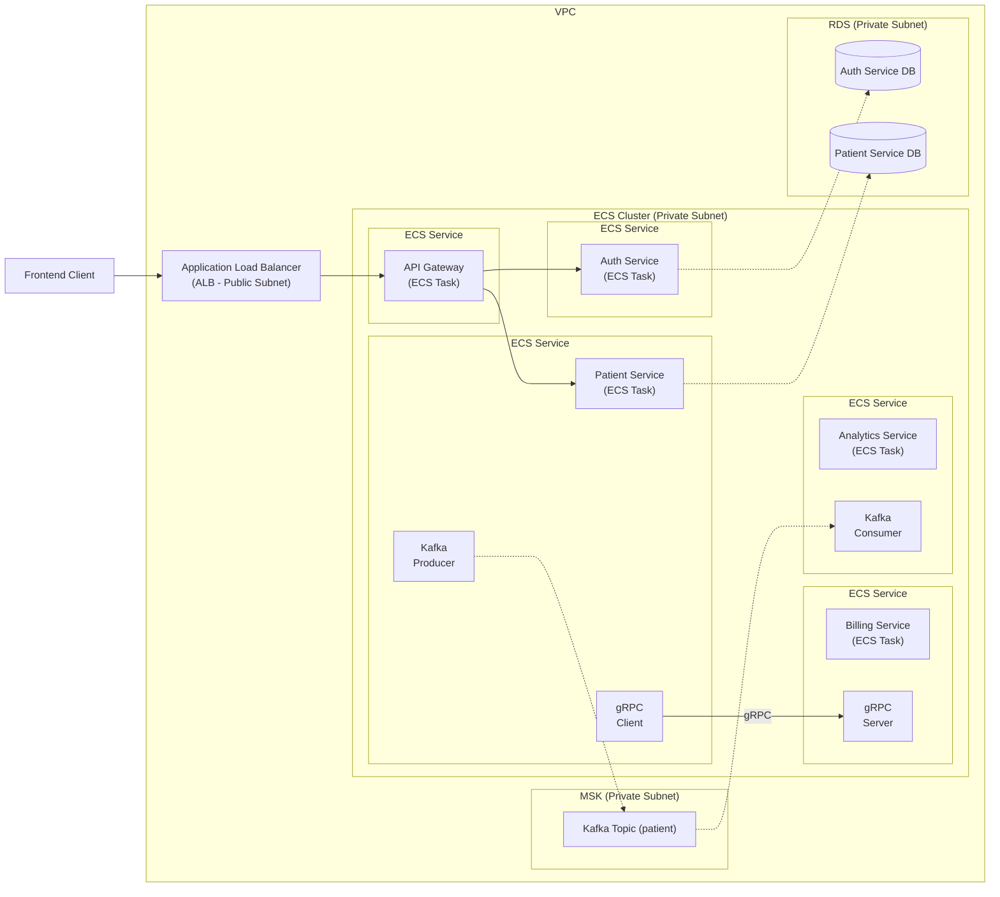

# Patient Management System

A microservices-based patient management system built with Spring Boot and Spring Cloud. Five
services covering REST APIs, gRPC inter-service communication, event-driven messaging via Kafka, JWT
authentication, and an AWS deployment written as CDK infrastructure-as-code and exercised locally
with LocalStack.

---

## Tech Stack

- **Java 21**, Spring Boot 3.2
- **Spring Cloud Gateway** — API gateway with custom JWT filter
- **gRPC + Protocol Buffers** — patient-service → billing-service
- **Apache Kafka (MSK)** — patient-service publishes events, analytics-service consumes
- **PostgreSQL (RDS)** — separate DB per service
- **Docker** — each service has a multi-stage Dockerfile
- **AWS CDK (Java)** — infrastructure as code (ECS Fargate, RDS, MSK, ALB)
- **LocalStack** — local AWS simulation

---

## Architecture



Focused views of the two inter-service paths live in [`docs/`](docs/) —
[gRPC](docs/gRPC-diagram.md) and [API gateway routing](docs/api-gateway-diagram.md).

## Services

| Service | Port | Responsibility |
|---|---|---|
| `api-gateway` | 4004 | Request routing, JWT validation filter |
| `auth-service` | 4005 | Login, token issuance |
| `patient-service` | 4000 | Patient CRUD, gRPC client, Kafka producer |
| `billing-service` | 4001 / 9001 | Billing accounts via gRPC server |
| `analytics-service` | 8080 | Event consumption from Kafka |

---

## Design decisions

Why each piece is here, including where the honest answer is "to learn it."

### gRPC for patient → billing
Synchronous, server-to-server, and the caller needs an answer before it can finish its own work —
which is exactly what gRPC is for. Protobuf gives a typed contract both sides compile against, so a
field rename breaks the build rather than failing silently at runtime, and the binary encoding over
HTTP/2 is meaningfully lighter than JSON over HTTP/1.1 for a call on the hot path. It was also
genuinely quick to wire up with the Spring Boot starter — the `.proto` file generates both the
client stub and the server base class.

Only one RPC method exists so far (`CreateBillingAccount`), so the contract benefit matters more
than the throughput one at current scale.

### Kafka for patient → analytics
Chosen partly as a deliberate learning goal — I wanted hands-on experience with event streaming
rather than only reading about it.

The architectural justification it turned out to have: analytics is a **read-side concern that must
never block or break a patient write**. If analytics is down, slow, or being redeployed, a doctor
still needs to save a patient record. Publishing to the `patient` topic and letting
`analytics-service` consume at its own pace decouples the two completely — the opposite property
from the gRPC call above, which is why the two use different transports rather than one for
everything.

### LocalStack instead of a real AWS account
Free, so the CDK stack can be deployed and torn down as many times as it takes to get it right
without a bill. More useful than that: it forces the infrastructure to actually be written and run
rather than described, so what's in `infrastructure/` is the real shape of the deployment — VPC, ECS
Fargate, RDS, MSK, ALB — and not a diagram of one.

The tradeoff is fidelity. LocalStack emulates AWS, it isn't AWS, and some behaviour differs (see the
ALB note below).

### Database per service
`auth-service` and `patient-service` own separate PostgreSQL instances. No shared schema means no
coupling through the data layer — neither service can quietly depend on the other's tables, so the
service boundary is enforced by the architecture rather than by discipline.

---

## Tests

Integration tests live in `integration-tests/` and run against **live services**, not mocks —
covering the full authentication flow and patient CRUD through the gateway.

```bash
cd integration-tests
mvn test
```

Per-service context tests: `AuthIntegrationTest`, `PatientIntegrationTest`,
`PatientServiceApplicationTests`, `BillingServiceApplicationTests`,
`AnalyticsServiceApplicationTests`.

---

## Running Locally

Each service is containerized. Build and run individually:

```bash
cd <service-dir>
docker build -t <service-name> .
docker run -p <port>:<port> <service-name>
```

Services that require a database need `SPRING_DATASOURCE_URL`, `SPRING_DATASOURCE_USERNAME`, and
`SPRING_DATASOURCE_PASSWORD` set as environment variables.

The API gateway expects:
- `AUTH_SERVICE_URL` — address of the auth service
- `SPRING_PROFILES_ACTIVE=prod` for production routing config

Ready-made HTTP and gRPC calls for manual testing live in `api-requests/` and `grpc-requests/`.

---

## AWS Deployment (LocalStack)

Requires [LocalStack](https://localstack.cloud) running on `http://localhost:4566` and AWS CDK
installed.

```bash
# Synthesize the CloudFormation template
cd infrastructure
mvn compile exec:java

# Deploy to LocalStack
./localstack-deploy.sh
```

The CDK stack provisions: VPC, ECS Fargate cluster, RDS PostgreSQL instances, MSK Kafka cluster, and
an Application Load Balancer.

> Note: ALB (`elbv2`) requires a paid LocalStack license. Without it, the API gateway remains
> accessible at `http://localhost:4004` — the same entry point as the local Docker setup.

---

## API Routes

All requests go through the gateway at `http://localhost:4004`.

| Method | Path | Routes to |
|---|---|---|
| POST | `/auth/login` | `auth-service` |
| GET/POST/PUT/DELETE | `/api/patients/**` | `patient-service` (JWT required) |
| GET | `/api-docs/patients` | `patient-service` OpenAPI docs |
| GET | `/api-docs/auth` | `auth-service` OpenAPI docs |
