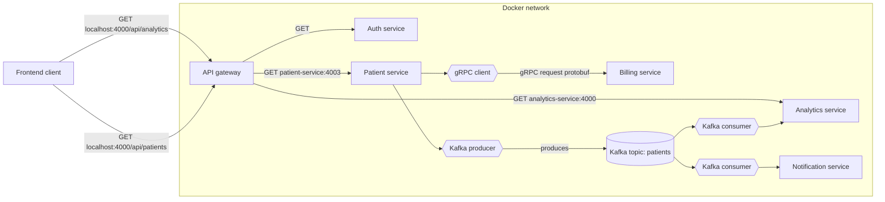

```mermaid
flowchart LR
    Frontend[Frontend client] -->|GET localhost:4000/api/analytics| Gateway
    Frontend -->|GET localhost:4000/api/patients| Gateway[API gateway]

    subgraph Docker[Docker network]
        Gateway -->|GET| Auth[Auth service]
        Gateway -->|GET patient-service:4003| Patient[Patient service]
        Gateway -->|GET analytics-service:4000| Analytics[Analytics service]

        Patient --> GrpcClient{{gRPC client}}
        GrpcClient -->|gRPC request protobuf| Billing[Billing service]

        Patient --> KProducer{{Kafka producer}}
        KProducer -->|produces| Topic[(Kafka topic: patients)]

        Topic --> KConsumer1{{Kafka consumer}}
        Topic --> KConsumer2{{Kafka consumer}}
        KConsumer1 --> Analytics
        KConsumer2 --> Notification[Notification service]
    end
```