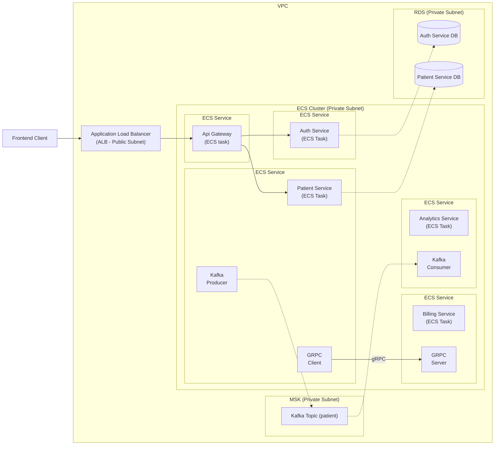

```mermaid
flowchart LR
    Frontend["Frontend Client"]

    subgraph VPC ["VPC"]
        ALB["Application Load Balancer\n(ALB - Public Subnet)"]

        subgraph ECS ["ECS Cluster (Private Subnet)"]
            subgraph ECS_Auth ["ECS Service"]
                Auth["Auth Service\n(ECS Task)"]
            end

            subgraph ECS_Billing ["ECS Service"]
                Billing["Billing Service\n(ECS Task)"]
                GRPCServer["GRPC\nServer"]
            end

            subgraph ECS_Gateway ["ECS Service"]
                Gateway["Api Gateway\n(ECS task)"]
            end

            subgraph ECS_Patient ["ECS Service"]
                Patient["Patient Service\n(ECS Task)"]
                GRPCClient["GRPC\nClient"]
                KafkaProd["Kafka\nProducer"]
            end

            subgraph ECS_Analytics ["ECS Service"]
                Analytics["Analytics Service\n(ECS Task)"]
                KafkaCons["Kafka\nConsumer"]
            end
        end

        subgraph RDS ["RDS (Private Subnet)"]
            AuthDB[(Auth Service DB)]
            PatientDB[(Patient Service DB)]
        end

        subgraph MSK ["MSK (Private Subnet)"]
            KafkaTopic["Kafka Topic (patient)"]
        end
    end

    Frontend --> ALB
    ALB --> Gateway
    Gateway --> Auth
    Gateway --> Patient
    GRPCClient -->|gRPC| GRPCServer
    Auth -.-> AuthDB
    Patient -.-> PatientDB
    KafkaProd -.-> KafkaTopic
    KafkaTopic -.-> KafkaCons
```
