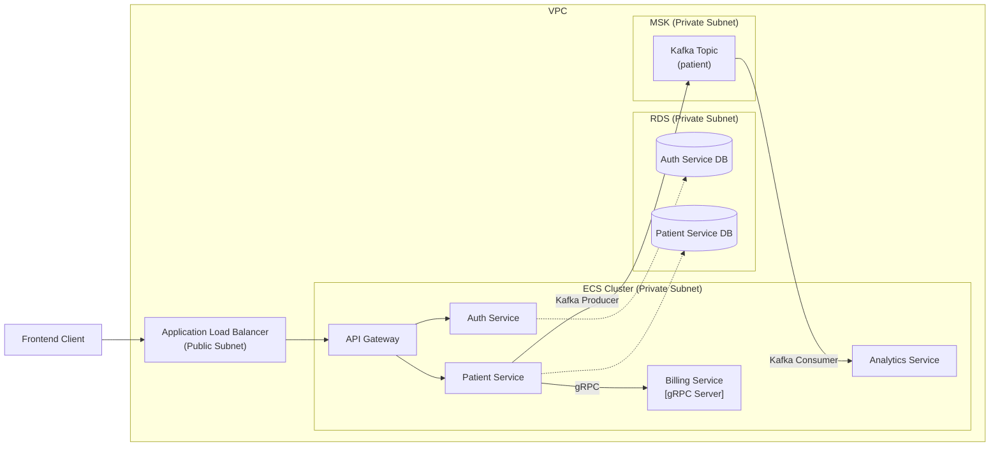

```mermaid
flowchart LR
    Frontend["Frontend Client"]

    subgraph VPC ["VPC"]
        ALB["Application Load Balancer<br/>(Public Subnet)"]

        subgraph ECS ["ECS Cluster (Private Subnet)"]
            Gateway["API Gateway"]
            Auth["Auth Service"]
            Patient["Patient Service"]
            Billing["Billing Service<br/>[gRPC Server]"]
            Analytics["Analytics Service"]
        end

        subgraph RDS ["RDS (Private Subnet)"]
            AuthDB[(Auth Service DB)]
            PatientDB[(Patient Service DB)]
        end

        subgraph MSK ["MSK (Private Subnet)"]
            Kafka["Kafka Topic<br/>(patient)"]
        end
    end

%% Flow
    Frontend --> ALB
    ALB --> Gateway

    Gateway --> Auth
    Gateway --> Patient

    Patient -->|gRPC| Billing

    Auth -.-> AuthDB
    Patient -.-> PatientDB

    Patient -->|Kafka Producer| Kafka
    Kafka -->|Kafka Consumer| Analytics
```
